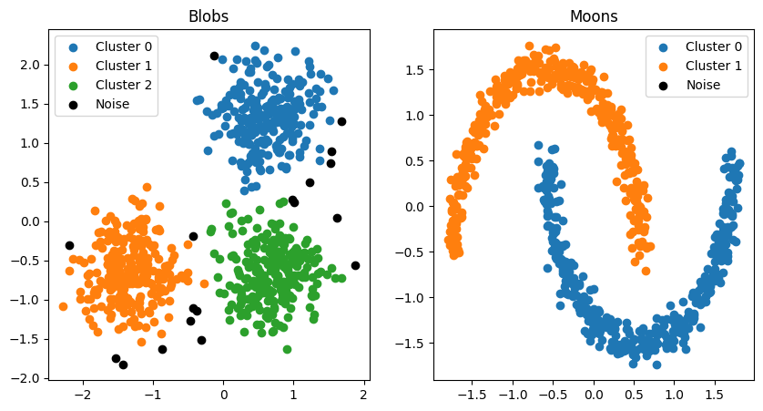

# Cluster algorithms
## DBSCAN

- Reference paper: [A Density-Based Algorithm for Discovering Clusters in Large Spatial Databases with Noise](https://www.dbs.ifi.lmu.de/Publikationen/Papers/KDD-96.final.frame.pdf)

- Official Scikit-Learn documentation: [sklearn.cluster.DBSCAN](https://scikit-learn.org/stable/modules/generated/sklearn.cluster.DBSCAN.html)

### Example usage

